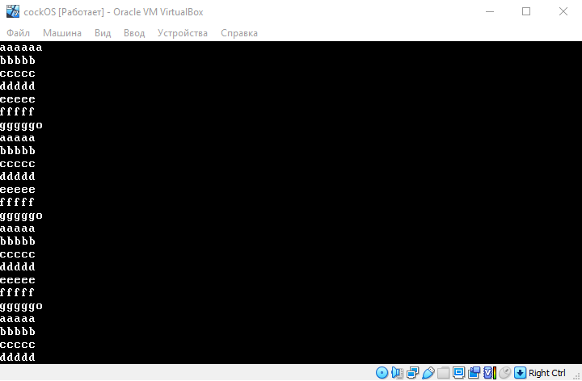

## My simple cockOS

### Simple operating system, that you can already boot using grub. Process of building is inside Makefile
### Planned to write:
- [x] kernel loader
- [ ] interrupts
- [ ] memory managment
- [ ] concurrency support
- [ ] simple file system

### Current version:
